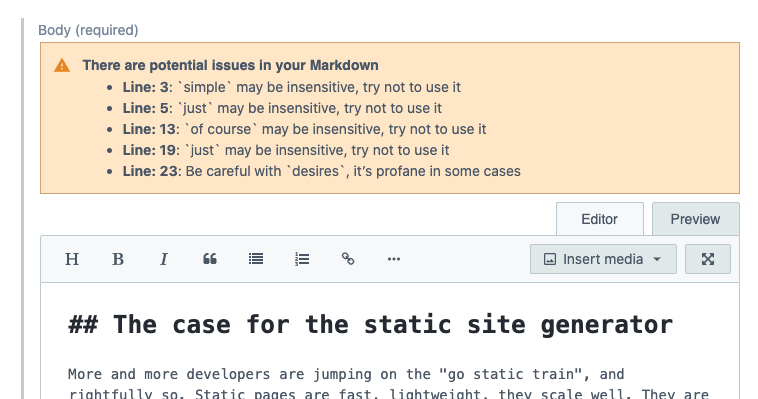
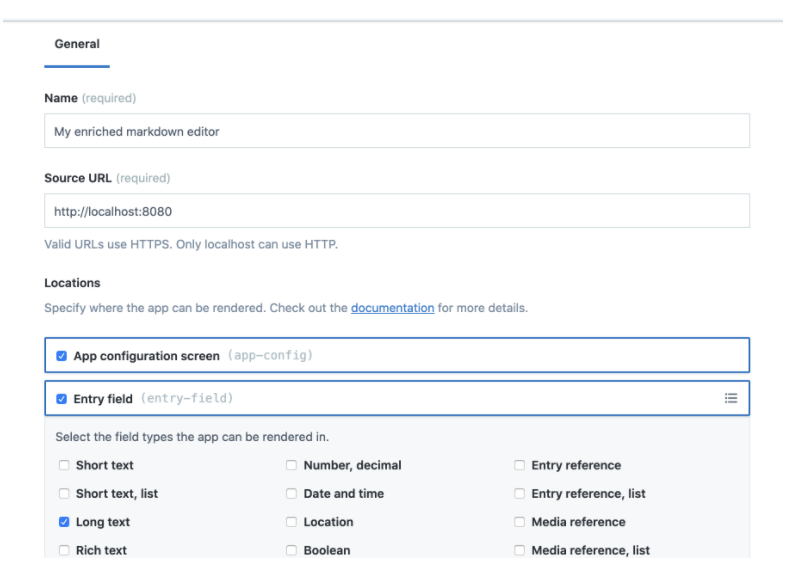
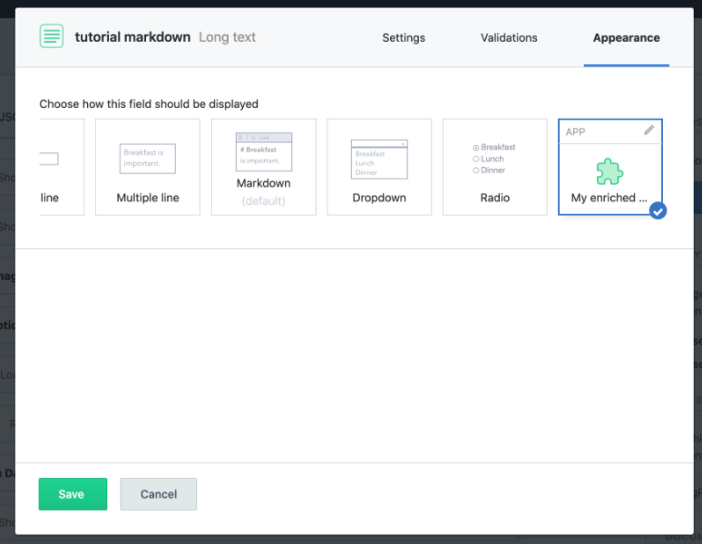

# Alex.js enriched Contentful Markdown editor



This project is an example of the use of [Contentfuls App Framework](https://www.contentful.com/developers/docs/extensibility/app-framework/), [the design system Forma 36](https://f36.contentful.com/) and [Contentful's open source field editors](https://www.contentful.com/developers/docs/extensibility/field-editors/).

These three tools build the foundation to enrich the Contentful UI.

**The Contentful App Framework** allows you to embed custom source code [in various locations](https://www.contentful.com/developers/docs/extensibility/app-framework/locations/).

**Forma 36** provides lots of React UI components that are ready to be imported in your project to look and feel like native Contentful UI.

**The open source field editors** allow you wrap and change existing components to create the editorial experience you need.

This project includes an example of an App that provides an enriched markdown editor.

## How to install an app in your Contentful organization

Contentful Apps work on a organization level. Open the top left space navigation and navigate to your "Organization Settings". Click on the "Apps" item in the top navigation and create a new new app.



Configure your new app as above. Give it a name and a source URL. **If you only want to use the final version of this repository define `https://contentful-enriched-markdown.netlify.app/` as the app source URL.**

In the locations section define the "App configuration screen" and "longtext" in the "Entry field" location. Save the app definition and install the app by clicking the "Install to space" button.

This action will redirect you to the app configuration screen. This application doesn't include additional space-specific configuration, so there is nothing to do here.

Head to the content model section and enable the field entry app for a longtext field. You'll find a new option in the "appearance" tab.

.

Save this new configuration and navigate to an entry of the content type you adjusted. There you'll find the new markdown editor available.

## How to develop your app

To build and use the project you have to have a current [Node.js](https://nodejs.org) version coming with [npm](https://www.npmjs.com) available on your machine. Run these commands in your environment:

```
git clone git@github.com:stefanjudis/contentful-enriched-markdown.git
cd contentful-enriched-markdown
npm install
npm start
```

`npm start` starts a new web server that will be available at `localhost:8080`. All you need to do to develop this app locally is to head to your app definition settings and change the Netlify URL to `localhost:8080`. That's it!

## Licence

[MIT](./LICENSE)
